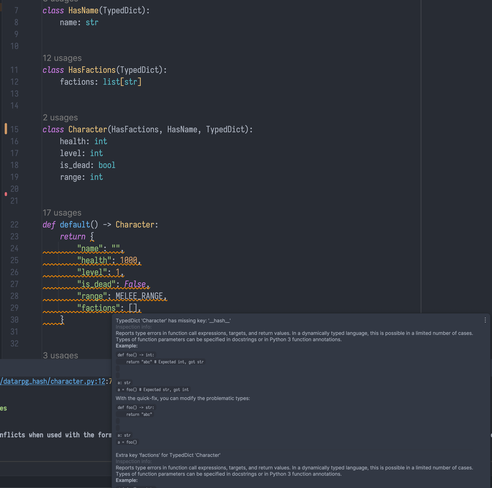

# datarpg

### Data oriented - RPG Combat Kata

#### v2



Pycharm inspection seems broken; pyright does say anything?

#### v1

A venture into the world of typesafe data oriented programming with python.

Constraints:

* use only `dataclass`, no `dict` or `TypedDict`;
  * necessary for IDE autocompletion and dot syntax
* use `Protocol`s for structural subtyping
* `mypy, pyright, ruff` with almost all rules and high strictness level must always have no warnings
* `pytest` always green (other than refactor cycles obviously)
* understand if extremely dynamic data-orientedness (everthing is a map) can be tempered in a modicum of typesafety and
  IDE help
* have fun

Retrospective:

I think the mission was a failure (other than the fun part).
My first insight was to shove everything combat-related in a combat module, but iteration five (add props)
bit me in the butt and forced me to `make the change easy then make the easy change` so I divided everything
in specific functions per type plus a general orchestrator in the combat module. In the end, I am still too coupled
to specific type names more than shapes and my generic functions is basically ugly single dispatch.
Nothing like clojure multimethods! This looks like some sort of weird semifunctional exercise :)

* understand if `TypedDict`s can compose, but I think not;
  * wonder if using dataclasses for IDE completion but then just passing `dataclass.asdict()` makes sense
  * is `TypedDict` able to work like a TS interface?
* Protocols had to intermingle with dataclass specific implementation dunders to not make mypy go crazy when using `dataclass.replace()`
  * price to pay for the dataclass constraint
  * copying dataclasses like that really sucks
* seems like multiple inheritance with mixins is stil the way to go to not get crazy with `cast()` and so on
  * i.e. things like

```python
@dataclass
class Health:
    _health: int
    
    def health(self) -> int:
        return self._health
```
  * need to expose methods rather than fields
* no world state to handle
* pure functions still beat everything when testing
* wondering how this would look like in Scala, JS/TS, classical OOP
  * Scala
    * typeclasses implementation to not couple to names
  * TS
    * intersection types seem incredibly powerful
    * JS objects are basically anonymous classes + hashmaps
    * TS type system is way better than py one 
* changes were actually very easy but I don't know if it's just because the exercise is too basic.

___

### Source material

Source: [https://github.com/ardalis/kata-catalog](https://github.com/ardalis/kata-catalog)

### Background

This is a fun kata that has the programmer building simple combat rules, as for a role-playing game (RPG). It is implemented as a sequence of iterations. The domain doesn't include a map or any other character skills apart from their ability to damage and heal one another.

### Instructions

1. Complete each iteration before reading the next one.

2. It's recommended you perform this kata with a pairing partner and while writing tests.

#### Iteration One

1. All Characters, when created, have:
    - Health, starting at 1000
    - Level, starting at 1
    - May be Alive or Dead, starting Alive (Alive may be a true/false)

1. Characters can Deal Damage to Characters.
    - Damage is subtracted from Health
    - When damage received exceeds current Health, Health becomes 0 and the character dies

1. A Character can Heal a Character.
    - Dead characters cannot be healed
    - Healing cannot raise health above 1000

#### Iteration Two

1. A Character cannot Deal Damage to itself.

1. A Character can only Heal itself.

1. When dealing damage:
    - If the target is 5 or more Levels above the attacker, Damage is reduced by 50%
    - If the target is 5 or more Levels below the attacker, Damage is increased by 50%

#### Iteration Three

1. Characters have an attack Max Range.

1. *Melee* fighters have a range of 2 meters.

1. *Ranged* fighters have a range of 20 meters.

1. Characters must be in range to deal damage to a target.

#### Retrospective

- Are you keeping up with the requirements? Has any iteration been a big challenge?
- Do you feel good about your design? Is it scalable and easily adapted to new requirements?
- Is everything tested? Are you confident in your code?

#### Iteration Four

1. Characters may belong to one or more Factions.
    - Newly created Characters belong to no Faction.

1. A Character may Join or Leave one or more Factions.

1. Players belonging to the same Faction are considered Allies.

1. Allies cannot Deal Damage to one another.

1. Allies can Heal one another.

#### Iteration Five

1. Characters can damage non-character *things* (props).
    - Anything that has Health may be a target
    - These things cannot be Healed and they do not Deal Damage
    - These things do not belong to Factions; they are neutral
    - When reduced to 0 Health, things are *Destroyed*
    - As an example, you may create a Tree with 2000 Health

#### Retrospective

- What problems did you encounter?
- What have you learned? Any new technique or pattern?
- Share your design with others, and get feedback on different approaches.

#### Resources

- Original Source: http://www.slideshare.net/DanielOjedaLoisel/rpg-combat-kata

